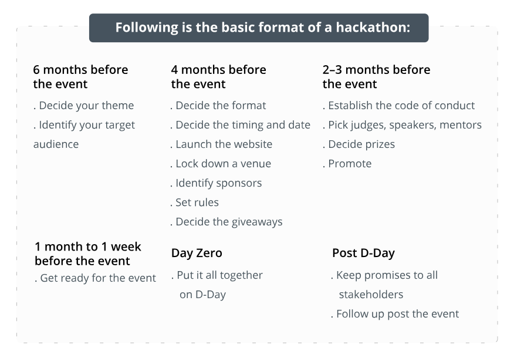

# Hackathon Ideas for the Codecademy Comunity <!-- omit in toc -->
### A proposal from Jason Newman (Jason N on the Circle Platform)

  *This Markdown file uses the [Markdown All in One](https://marketplace.visualstudio.com/items?itemName=yzhang.markdown-all-in-one) plugin to organize its Table of Contents.*

## Select a Section! <!-- omit in toc -->
- [Goals](#goals)
- [Requirements to Run a Successful Hackathon](#requirements-to-run-a-successful-hackathon)
- [Timeline](#timeline)
- [Sponsorship/Prizes](#sponsorshipprizes)
- [Measuring Participant Feedback/Event Success](#measuring-participant-feedbackevent-success)
- [References](#references)


## Goals

The goals for running a community Hackathon event are manyfold. As a member of the community, I would love to see more people actively engaging and collaborating together. If we can foster that engagement, we can help build a community portfolio which can help individuals in their careers and could present marketing opportunities for Codecademy itself.

If we opened this opportunity to people outside of the Codecademy platform we could also bring in different levels of expertise to help learners and drive new user enrollment to Codecademy.

The end goal however will be to give learners practical experience working as part of a team and to build their individual portfolios. If we can work in best practices for teamwork this could be a great opportunity for the less experienced developers.

[Back to the top](#select-a-section)

## Requirements to Run a Successful Hackathon

There are many components to carrying out a successful Hackathon event. If we proceed with this as a project, I will dedicate much of my own time to making this happen but, as I am imagining this as an official Codecademy event, I would anticipate receiving some guidance and support for the execution of these requirements.

My research indicates that we would need an event site for users to register on. This site should capture information on what the user is proficient in and what their interest would be. If we decide on a theme we may also want to use this page to gather the registrants' ideas for projects.

To that end, we also would need to decide if we are going to enforce a theme and what constraints that would put on the process. Personally, I think creating a broad theme where groups have the freedom to build individual ideas would be the best for engaging a wide group of users.

To incentivize people to join, it would be good to be able to offer some prizes. I don't expect that there would be anything major on offer for the first event we may run but having some expectation of some sort of swag - either badges they can put on their online profiles (such as on circle or on github) or stickers they can have on their laptop or somewhere else.

If we could find sponsors, perhaps we can offer larger prizes but sponsors bring up other questions. We would need to offer some value to the sponsor for their participation. The main question would be: how viable is it to get sponsors and what would that look like?

Lastly, we need to develop rules for operating the event. Obviously we will require participants to follow our community standards but we will want to set other rules. Not only rules of orderly conduct but also rules for how users should participate in the event, rules for the creation of teams, how and when moderators will engage with teams, clear terms of who owns the Intellectual Property of the projects created during the event, and how the submissions are judged. There are many other considerations we may want to define.

[Back to the top](#select-a-section)

## Timeline

From hackerearth.com's guide to organizing a hackathon:
    
```txt
The entire process of organizing a hackathon, marketing the event, driving registrations, ideating, and creating prototypes typically takes 30 to 40 days. An innovation program cannot get more agile than this.

Once you (the organizer) have decided why you want to conduct a hackathon, the next steps include deciding whom you want to engage and how you want to engage. Depending on their objective, companies may thus opt for either an internal hackathon or an external hackathon.

    Internal Audience – Internal Hackathon

If the objective is to engage your employees, promote a collaborative work environment, or create a culture of innovation, an internal hackathon is your best bet.
 ```

While participants won't likely be employed by Codecademy, I believe the thought process for an 'internal' hackathon - to engage the userbase, promote collaboration, and create innovative projects - aligns with our intentions.




Not knowing how many people might be organizing this event, I think a timeline would likely go to four to six months of organization before the event. Once we've discussed more we can nail down the timeline.

As for the Hackathon event itself, I think a decent timeline would be about two weeks. We would facilitate grouping users into their teams and encourage users to plan out their projects in detail before they begin prototyping. This may get narrowed down or spread out a bit, depending on the community's availability.

[Back to the top](#select-a-section)

## Sponsorship/Prizes

As stated in the [Requirements](#requirements-to-run-a-successful-hackathon) section, Sponsorship could be a difficult thing for us to tackle but I think it would be a key element of offering any prizes which could drive engagement/participation.

Examples of possible Sponsors/Prizes:
 - An offer of a limited pro-membership to Codecademy
 - [Codementor](https://www.codementor.io/) is a site that offers to connect their users with a Top Developer. If we could get them to agree to sponsor this sort of event it could help build a relationship with Codecademy and its users. We might be able to get a few of their mentors to judge submissions and/or offer limited sessions with them.

We could consult individuals like [Joshua Tauberer](https://joshdata.me/) who have extensive experience participating in and running Hackathon events for help for finding and engaging sponsors for our community.

At the bare minimum I think we offer some basic commemorative items like tags on circle, pins for github, physical stickers, magnets, or other swag.

[Back to the top](#select-a-section)

## Measuring Participant Feedback/Event Success

If we plan to repeat this event, we will want to capture notes on what we did, what went well, what went wrong, and what was missing entirely. We would want to gauge user experience (both during and after via feedback requests) and analyze participation percentages to gain perspective on how the event went.

Ideally, we would keep a record of these metrics so we can copy what we did right and avoid what we went wrong. We would also want to take the time to compute costs and write some final remarks about the end of the event.

[Back to the top](#select-a-section)

## References
- [How to run a successful Hackathon](https://hackathon.guide/) by Joshua Tauberer
- Click Up: [How to Organize a Hackathon](https://clickup.com/blog/how-to-organize-a-hackathon/#:~:text=Structure%20of%20Hackathons,-The%20structure%20of&text=The%20first%20critical%20step%20is,with%20the%20event's%20overall%20theme.)
- hackerearth.com: [The complete guide to organizing a successful hackathon](https://www.hackerearth.com/community-hackathons/resources/e-books/guide-to-organize-hackathon/)
- edison365: [How to Run a Hackathon in 2024](https://edison365.com/how-to-organize-a-successful-hackathon/)

[Back to the top](#select-a-section)